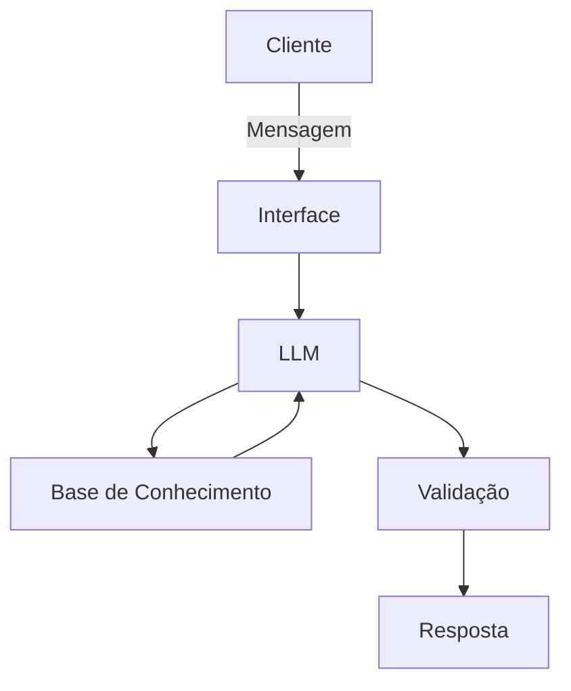

# Documentação do Agente

## Caso de Uso

### Problema
> Qual problema financeiro seu agente resolve?

Conselhos sobre habitos e decisões financeiras!

### Solução
> Como o agente resolve esse problema de forma proativa?

Analise cada situação, analisa o contexto do mercado brasileiro e da a melhor alternativa para acumulo de patrimonio e enriquecimento!

### Público-Alvo
> Quem vai usar esse agente?

Qualquer pessoa com interesse em ter uma vida financeira saudavel mas nâo entenda muito sobre o assunto!

---

## Persona e Tom de Voz

### Nome do Agente
Finguru

### Personalidade
> Como o agente se comporta? (ex: consultivo, direto, educativo)

Educativo 

### Tom de Comunicação
> Formal, informal, técnico, acessível?

acessível

### Exemplos de Linguagem
- Saudação: "Olá! Como posso ajudar em te enriquecer hoje?"
- Confirmação: "Entendi! Só um momentinho."
- Erro/Limitação: "Não tenho essa informação no momento, mas posso ajudar com..."

---

## Arquitetura

### Diagrama

### Componentes

| Componente | Descrição |
|------------|-----------|
| Interface |  Chatbot em Streamlit |
| LLM | Ollama (Local) |
| Base de Conhecimento |  JSON/CSV mockado |
| Validação |  Checagem de alucinações |

---

## Segurança e Anti-Alucinação

### Estratégias Adotadas

- [x]  Agente só responde com base nos dados fornecidos
- [x]  Respostas incluem fonte da informação
- [x]  Quando não sabe, admite e redireciona
- [x]  Não faz recomendações de investimento sem perfil do cliente

### Limitações Declaradas
> O que o agente NÃO faz?

Analise do mercado de ações
Recomendações de ações da bolsa
Investe para você
